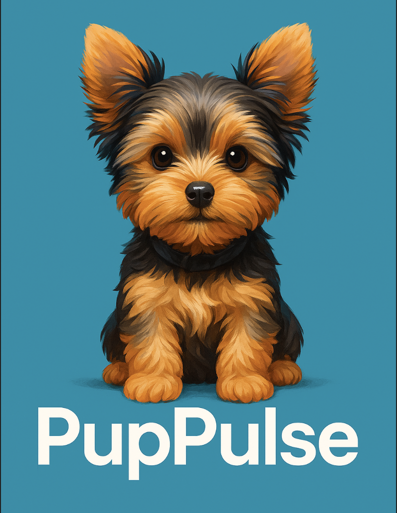

# PupPulse

Real-time Emotion & Action Monitoring for Dogs

---

## Table of Contents

1. [Project Overview](#project-overview)
2. [Features](#features)
3. [Prerequisites](#prerequisites)
4. [Installation](#installation)
5. [Usage](#usage)
6. [Project Structure](#project-structure)
7. [License](#License)

---

## Project Overview

PupPulse is a real-time multimodal system that monitors the actions (sit, lie down, wag tail, etc.) and emotions (excited, relaxed, anxious, etc.) of your dog using a standard camera and microphone.

---

## Features

1. Multimodal Recognition

   * Visual+Audio parallel processing for real-time action and emotion classification

2. Personalized Fine-tuning

   * Pretrain on public datasets + auto-label your dog’s videos via ChatGPT Vision

3. Web Dashboard

   * FastAPI + WebSocket with second-level updates for confidence bars & timeline

4. Interactive Feedback

   * Connect to feeder or smart lights for alerts or auto-treat dispensing

5. Extensible

   * Extendable with 3D pose estimation, bark sentiment analysis, voice Q\&A

---

## Prerequisites

* Python 3.10+
* Miniconda / Conda
* Git & GitHub account

---

## Installation

1. Clone the repository

   ```bash
   git clone https://github.com/username/pup-pulse.git
   cd pup-pulse
   ```
2. Create conda environment

   ```bash
   conda create -n pup-pulse python=3.10 -y
   conda activate pup-pulse
   ```
3. Install dependencies

   ```bash
   pip install -r requirements.txt
   ```
4. Prepare data

   * download data to `data/raw/`
   * run `scripts/download_sample.sh`

---

## Usage

1. **Train base model**

   ```bash
   python src/models/train_base.py --config configs/base_action.yaml
   ```
2. **Auto-label your dog**

   ```bash
   python src/utils/auto_label.py --input data/raw/mydog_videos/ --output data/labels/
   ```
3. **Fine-tune personalized model**

   ```bash
   python src/models/train_finetune.py --config configs/finetune.yaml
   ```

---

## Project Structure

```text
pup-pulse/
├── assets/             # Images and logos
├── data/               # Raw and annotated data
├── src/                # Source code
│   ├── models/         # Model definitions & training scripts
│   ├── utils/          # Data loading & labeling scripts
│   └── api/            # FastAPI service code
├── requirements.txt    # Python dependencies
├── environment.yml     # Conda environment file
├── README.md           # Project documentation
└── .gitignore
```


## License

This project is licensed under the MIT License. See [LICENSE](LICENSE) for details.


